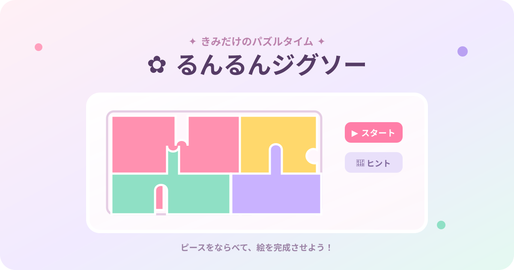

# るんるんジグソー

好きな画像を選んで遊べる、スマホ対応のかわいいジグソーパズルゲームです。

## 遊び方

1. 「すきな画像をえらぶ」から画像を選択
2. 難易度を選択
3. 「スタート」を押す
4. ボード上のピースを2つタップして入れ替える
5. 「ヒント」で元画像を一時表示

完成すると「完成！」のリアクションが表示されます。

## 特徴

- ユーザーが選んだ画像をパズル化
- 3段階の難易度
- スマホ画面に対応したレスポンシブデザイン
- ヒント表示と完成演出
- Vercelで公開中

## 遊ぶ

[るんるんジグソーを開く](https://runrun-jigsaw.vercel.app/)

## 技術

HTML / CSS / JavaScript（外部ライブラリなし）
